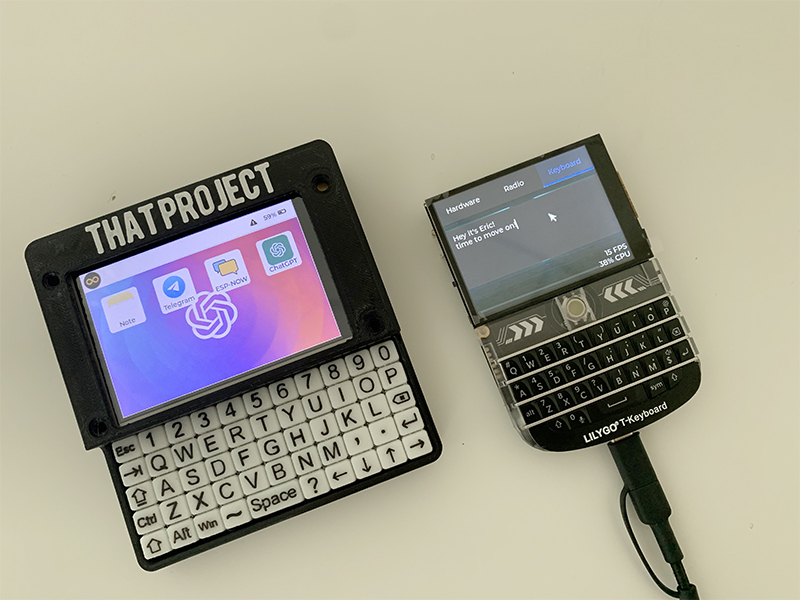
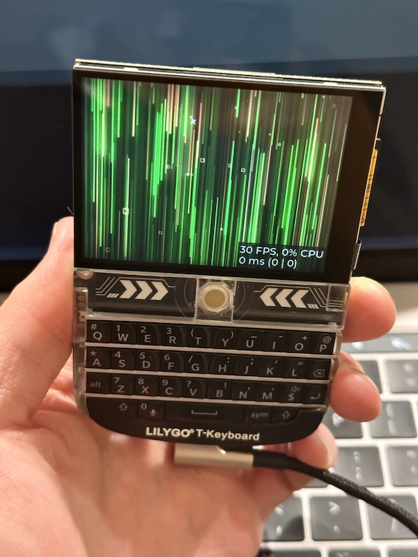
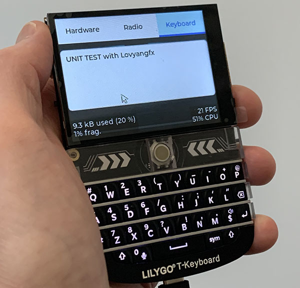
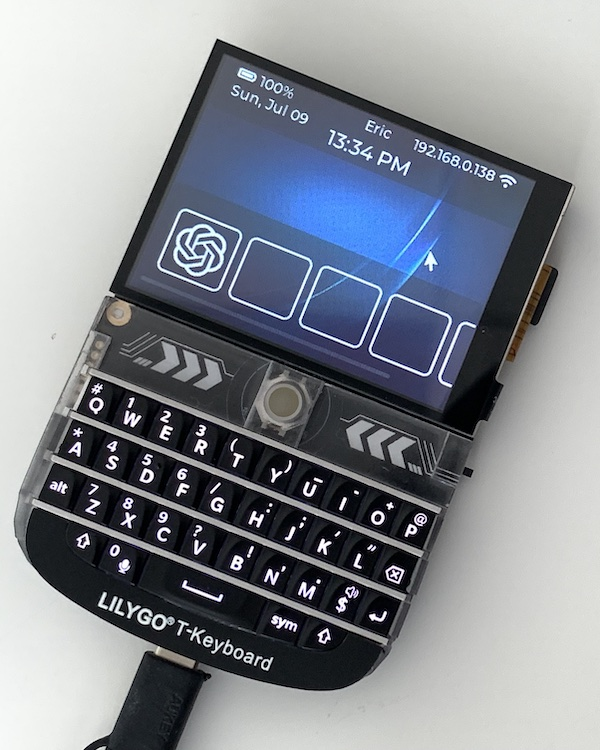

# Welcome to New ESP32Berry Project

## *Updates*
05-23-2024: 0_UnitTest_LovyanGFX Updated! 

## Preparing for the next version
I'm preparing a new ESP32Berry project based on LVGL 9. I'll do my best to share it ASAP.
 

### Unit Test with LovyanGFX in Arduino Platform
Use LovyanGFX instead of TFT_eSPI to update the screen. This makes it possible to update the screen more quickly than TFT_eSPI. In order to run this without problems, first configure the development environment using the T-Deck library officially supported by LilyGO. https://github.com/Xinyuan-LilyGO/T-Deck

 

### *Version 0.5

- Base Structure
- LVGL Environment 
- Home Screen 
- Second Screen for Apps 
- Control Panel (Volume/Brightness)
- Dynamic WiFi Selection 
- ChatGPT Client

### MIT License

Copyright (c) 2023 Eric Nam

Permission is hereby granted, free of charge, to any person obtaining a copy
of this software and associated documentation files (the "Software"), to deal
in the Software without restriction, including without limitation the rights
to use, copy, modify, merge, publish, distribute, sublicense, and/or sell
copies of the Software, and to permit persons to whom the Software is
furnished to do so, subject to the following conditions:

The above copyright notice and this permission notice shall be included in all
copies or substantial portions of the Software.

THE SOFTWARE IS PROVIDED "AS IS", WITHOUT WARRANTY OF ANY KIND, EXPRESS OR
IMPLIED, INCLUDING BUT NOT LIMITED TO THE WARRANTIES OF MERCHANTABILITY,
FITNESS FOR A PARTICULAR PURPOSE AND NONINFRINGEMENT. IN NO EVENT SHALL THE
AUTHORS OR COPYRIGHT HOLDERS BE LIABLE FOR ANY CLAIM, DAMAGES OR OTHER
LIABILITY, WHETHER IN AN ACTION OF CONTRACT, TORT OR OTHERWISE, ARISING FROM,
OUT OF OR IN CONNECTION WITH THE SOFTWARE OR THE USE OR OTHER DEALINGS IN THE
SOFTWARE.