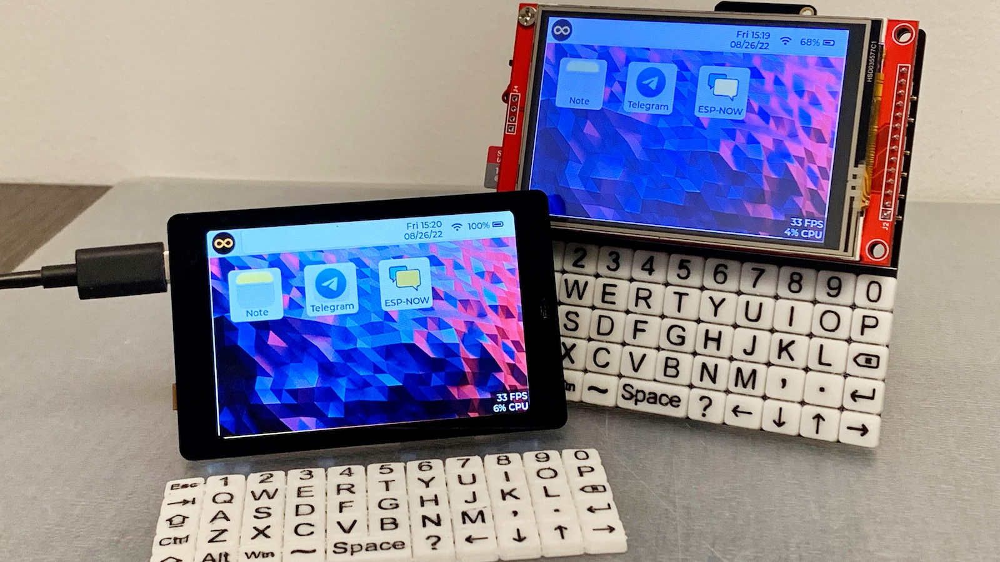
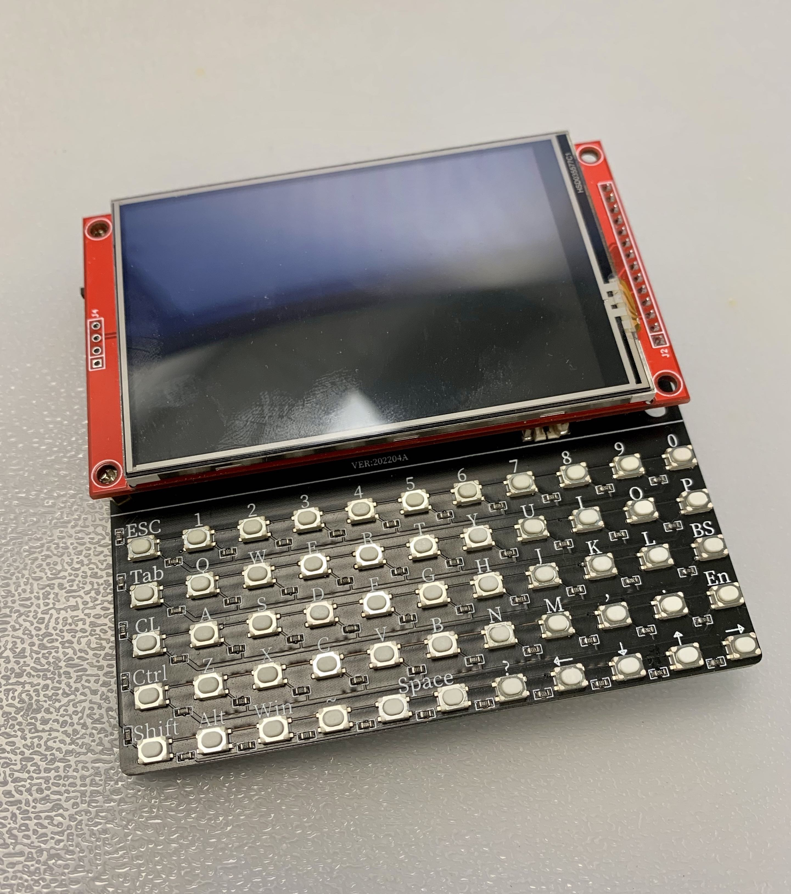
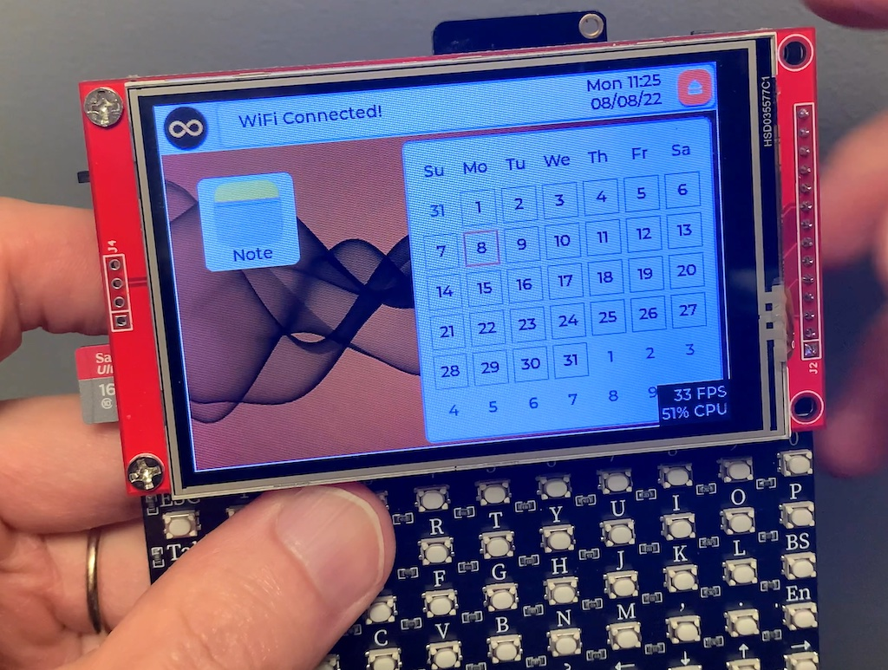

[](https://www.that-project.com)
[](https://www.that-project.com)

## ESP32Berry Project
This project is experimental and not yet complete. As it is updated, I will continue to share it through [my channel.](https://www.that-project.com)
I made a physical keyboard for use with the ESP32. I'm pretty sure to more interesting applications are possible with this.


### Version 0.3 
[](https://youtu.be/UhIXAp2wqjg)

[ESP32Berry, "ESP-NOW Chat App" Version 0.3](https://youtu.be/UhIXAp2wqjg)

In this version 0.3, added a chatting app using ESP-NOW and supported Non-Keyboard ESP32 products. 

#### How to use for other devices
*Works only in 480x320 resolution. It hasn't been tested enough yet. It will work more stably in the next version.*

ESP32Berry_Config.h
```
Remove the #define ESP32BERRY
```
ESP32Berry_Display.h
```
Set LovyanGFX with the graphic driver ic chip you are using. 
```
ESP32Berry_Display.cpp
```
If touch calibration is required separately, modify the necessary information in init_tft().
```
Partition Scheme
```
Since the size of this application is larger than the default partition scheme, it must be changed. (Over 1.4MB)
```

### Version 0.2
[](https://youtu.be/h28_Mvgpe2Y)

[ESP32Berry, "Telegram App" Version 0.2](https://youtu.be/h28_Mvgpe2Y)

In this version 0.2, an overall system upgrade and Telegram app have been added to send and receive messages through Telegram API. 

*Added features
- Telegram App
- Notification 
- Menu SDCard
- Menu Battery

### Version 0.1
[](https://youtu.be/wqaxCAcghtk)

[ESP32Berry, "WiFi connection & Simple Note App" Version 0.1](https://youtu.be/wqaxCAcghtk)

In this version 0.1, I focused on creating a very basic framework. The first added features are a WiFi dynamic connection and a Note app that can read and write to the SD card.  


### Created & Maintained By

[Eric Nam](https://github.com/0015)
([Youtube](https://youtube.com/ThatProject))
([Facebook](https://www.facebook.com/groups/138965931539175))


### MIT License

Copyright (c) 2022 Eric Nam

Permission is hereby granted, free of charge, to any person obtaining a copy
of this software and associated documentation files (the "Software"), to deal
in the Software without restriction, including without limitation the rights
to use, copy, modify, merge, publish, distribute, sublicense, and/or sell
copies of the Software, and to permit persons to whom the Software is
furnished to do so, subject to the following conditions:

The above copyright notice and this permission notice shall be included in all
copies or substantial portions of the Software.

THE SOFTWARE IS PROVIDED "AS IS", WITHOUT WARRANTY OF ANY KIND, EXPRESS OR
IMPLIED, INCLUDING BUT NOT LIMITED TO THE WARRANTIES OF MERCHANTABILITY,
FITNESS FOR A PARTICULAR PURPOSE AND NONINFRINGEMENT. IN NO EVENT SHALL THE
AUTHORS OR COPYRIGHT HOLDERS BE LIABLE FOR ANY CLAIM, DAMAGES OR OTHER
LIABILITY, WHETHER IN AN ACTION OF CONTRACT, TORT OR OTHERWISE, ARISING FROM,
OUT OF OR IN CONNECTION WITH THE SOFTWARE OR THE USE OR OTHER DEALINGS IN THE
SOFTWARE.