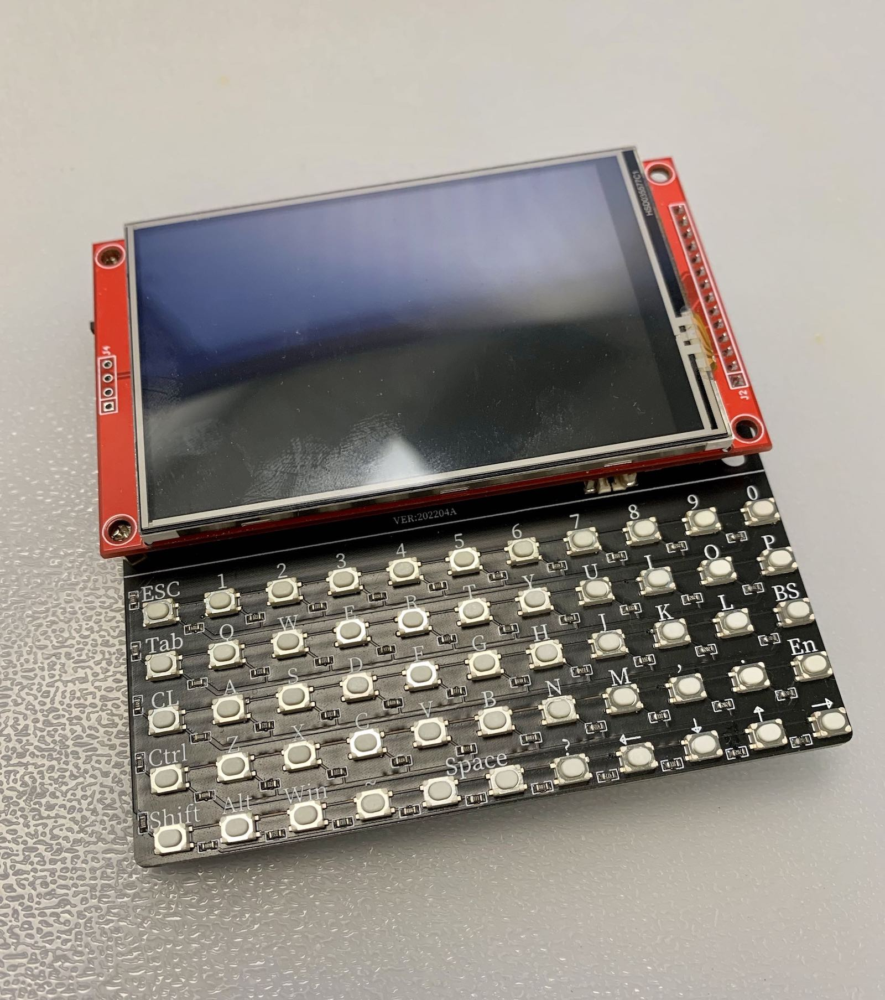

## ESP32Berry Project
This project is experimental and not yet complete. As it is updated, I will continue to share it through [my channel.](https://www.that-project.com)

I made a physical keyboard for use with the ESP32. Until now, text was entered using the virtual keyboard, but typing was not easy due to the small screen. It seems that more interesting applications are possible with this.

### Version 0.1

ESP32Berry, "WiFi connection & Simple Note App" Version 0.1
In this version, I focused on creating a very basic framework. The first added features are a WiFi dynamic connection and a Note app that can read and write to the SD card.  
